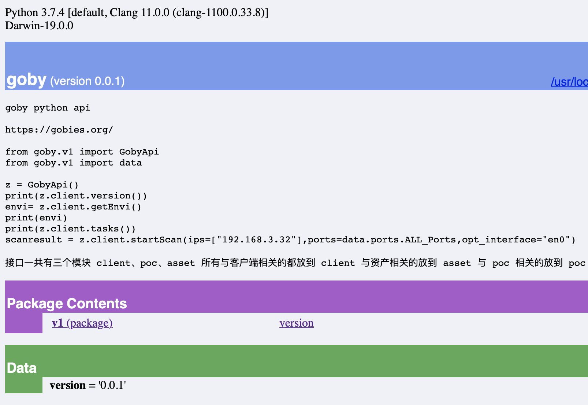

## 开发说明

接口一共有三个模块 client、poc、asset 所有与客户端相关的都放到 client 与资产相关的放到 asset 与 poc 相关的放到 poc。通过抓包进行分析 api 得出接口

### 未接入的api接口

1. Poc 相关部分接口没有开发

2. Asset 部分未开发

   ```
   /api/v1/deleteAssets
   /api/v1/hostSearch
   /api/v1/importAssets
   /api/v1/assetDetail
   ```


## 使用文档

### 1. 安装模块

下载后在此目录下执行
```shell
python setup.py install
```
### 2. 使用模块

```pythonj 
from goby.v1 import GobyApi
from goby.v1 import data

z = GobyApi()
print(z.client.version())
envi = z.client.getEnvi()
print(envi)
print(z.client.tasks())
scanresult = z.client.startScan(ips=["192.168.3.32"], ports=data.ports.ALL_Ports, opt_interface="en0")
```

### 高级用法
#### 需要用户认证
```python
z = GobyApi(apiurl="http://127.0.0.1:8361",user="user",password="pass")
print(z.client.version())
```
#### 修改 user-agent  
默认的 user-agent 为 goby-api 0.0.1(api版本号)
如果修改可以参考 requests 库
```python
headers={
'User-Agent': 'hack 2.0'
}
pam = GobyApi("http://127.0.0.1:8631",headers=headers)
```

需要注意 `'Content-Type': 'application/json'` 因为 goby 接口原因无法修改
#### 使用代理  
```python
proxies={
    'https':'http://localhost:8080',
    'http':'http://localhost:8080'
}
pam = GobyApi(proxies=proxies)
```

余下功能可以参考 [requests 高级用法](https://2.python-requests.org//en/master/user/advanced/)   
### API 参考手册
安装以后可以在命令行中使用`pydoc -p 12315` 查看文档


## 生成模块
```shell
python setup.py sdist
sudo python setup.py install
```
## 问题
 1. 如果发现查询不到数据请注意查看查询字符串格式**尤其注意引号的规范使用**
